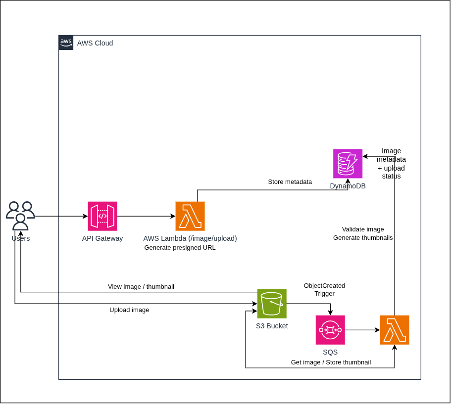

# AWS Serverless Image Pipeline

## Architecture



## How to run

```
$ cd infrastructure
$ cdk bootstrap
$ cdk deploy
```

Then to upload a file
```
$ cd scripts
$ uv run upload.py
```

Sample output: 
```
Enter file path: [file_path]
Image Id: 01KYPZQARWKQF0HK8V4Y317DC5
Uploading...
File uploaded, View at https://[bucket-name].s3.amazonaws.com/uploads/01KYPZQARWKQF0HK8V4Y317DC5/picture-abc.jpg
Thumbnail at: https://[bucket-name].s3.amazonaws.com/thumbnails/01KYPZQARWKQF0HK8V4Y317DC5/picture-abc.webp
```

Note: It takes a few seconds for the thumbnail to be generated

## Notes

This project demonstrates a serverless image processing pipeline with AWS Lambda and S3. 

The client first calls `/image/upload`, which is handled by the API Gateway, it then triggers the upload function. `mime_type` and `filename` are passed as request body to the POST call, the upload function generates a ULID for the file, then creates a dynamodb entry for the file, with status set to `upload_pending`

Then it returns the image id, the object key - which is of the form `uploads/[id]/[sanitized-filename].[ext]` (Note that the extension is derived from the mime type passed, and the extension from file name is not considered), and the S3 presigned POST for the client to upload the image. Note, S3 doesn't check if the actual contents of the file are valid, so the process lambda checks if the file is actually an image.

I have used presigned POST instead of presigned PUT (which generates a simpler url) because presigned PUT doesn't support setting a maximum file size. This is an issue because S3 by default supports file uploads of upto 5GB in a single PUT request. Presigned POST supports setting a custom cotent length range, and I set it to 10 MB so that files greater than 10MB are rejected by S3

Note: Presigned URLs are cryptographically created with the IAM credentials of the signer. The upload lambda doesn't communicate with S3, and instead uses it's credentials to sign a request. When the client uses the presigned URL / post to upload the file, S3 validates if the signer (in this case, the lambda) has the required permissions to put an object

Also AWS automatically creates temporary STS credentials for the lambda execution role, which automatically get deleted after a while. So if a lambda signs and returns a presigned post/put url, but if it's credentials expire before the presigned url's expiry, S3 will deny the request.

If very long lived presigned urls are required (for example 7 days), the requests must be signed with credentials that remain valid for the desired lifetime. This can be done with long lived IAM user credentials, though it's not recommended

Then the client directly submits the form to S3 using a POST request, this completely bypasses the server (or lambda + api gateway here). This avoids lambda execution time and API gateway processing for the file itself. The server only acts as the control layer. S3 requests, data bandwidth, and storage charges still apply.

A S3 trigger is created on the prefix `uploads/` so that whenever a new object is created with that prefix, S3 triggers the lambda. If a prefix is not supplied, and the thumbnails are written to the same bucket, it recursively triggers the lambda again, thereby leading to lambda recursive runaway. This can create an infinite processing loop which can lead to huge charges


The process function splits the object key, gets the id and filename, uses `PIL` library to resize the image and then stores it as a webp file in `thumbnails/`. This is just an example application, but any kind of image processing can be implemented here.

CDK consists of two parts

Constructs library - consists of modular components that can be assembled together to develop infrastructure quickly

CDK Toolkit - CLI & toolkit library - used to perform sync, deployment etc

Many constructs -> stack -> many stacks form a app, CDK synthesizes the code to a Cloudformation template (YAML or JSON), which is then deployed by Cloudformation to create the required resources

To view logs

```
aws logs tail /aws/lambda/[group] --follow
```

File states
- upload_pending
- uploaded
- processing
- completed 
- failed

Limitations

The main goal of this project is to demonstrate serverless architecture
In a production system, additional mechanisms would typically be added, such as:

- Recovery of images in `processing` state due to lambda failures / timeouts
- Cloudwatch metrics & alarms

SQS is useful here to handle burst traffic - i.e. say our concurrency limit is 100, but there is a burst upload of 10000 pics, with a queue, these events can safely wait while the lambdas clear the backlogs

SQS (Simple Queue service) is a service that can be placed between producers and consumers, the producers place messages into the queue, while the consumers takes out messages and processes them. After a message is processed, it's deleted from the queue. The consumers poll the queue for new messages. SNS, S3, Lambda, etc can directly publish messages to the queue.

Lambdas automatically scale depending upon the backlog of the queue

The consumer must delete the message from the queue after processing, otherwise the message will get processed again by another worker indefinitely

A dead letter queue is another SQS that acts as a temporary storage for failed messages, this can be helpful in identifying the cause of failures

Visibility timeout: Amount of time for which the message is invisible to other consumers (when it's being processed by one worker), usually it's recommended to set it to 6x the processing time. If it's too short, the timeout occurs before processing is complete, and another worker picks up the task, which also fails, and finally the task ends up in the DLQ 

When you add an event source, behind the scenes, AWS Lambda Event Source Mapping resource is created, it handles polling, and marking queue messages as done. If the lambda throws an error, the item is not marked done. Note: In case of partialfailures, aws marks the batch of 10 (or whatever batch size) as failed. Enable `reportBatchItemFailures`, and return a list of ids that have failed, so that only they can be processed again

Also found `s3:TestEvent` this event in the DLQ, after reading, found out that S3 sends out this event to test if the connection is working